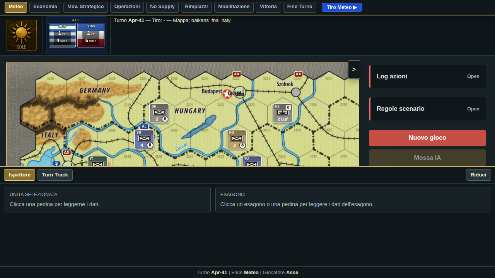
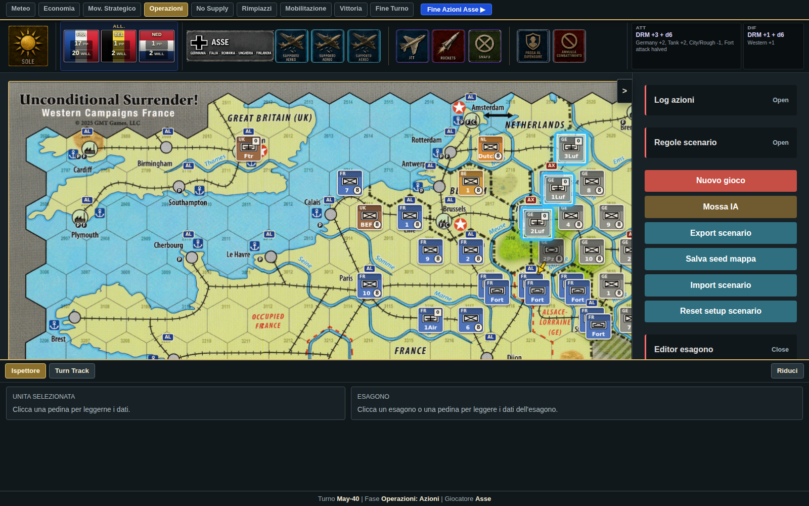

# Audit del gioco — USWC Digital (31 luglio 2026)

> **Stato correzioni.** Sono già stati corretti e verificati: la **CRT** (20 celle),
> la **tabella meteo** (6 righe) e i **quattro interventi UX prioritari** (mappa a
> tutta finestra con zoom/pan, splash raggiungibile, feedback su Mobile→Assalto e
> su avanzamento fase bloccato, conferma su Nuovo gioco). Le voci relative restano
> qui sotto come documentazione di cosa non andava. Tutto il resto è ancora aperto.

Audit completo di: build/test, fedeltà al regolamento (verificata **direttamente sul PDF** `Varie Carte/USWC_Rules.pdf`, sul Player Aid `Varie Carte/Tabelle US.pdf` — CRT e tabella meteo lette dalle scansioni ad alta risoluzione — e sul Playbook), motore di gioco, scenari e interfaccia.

Nota: gli scenari **Barbarossa 1941** e **Russia 1941-44** sono fan-made e sono stati valutati solo per coerenza interna, non contro il rulebook ufficiale.

---

## 1. Stato generale: funziona?

| Verifica | Esito |
|---|---|
| `yarn install` | ✅ OK |
| `yarn test` (packages/shared, vitest) | ✅ **357/357 verdi** (8 file di test) |
| Build `@uswc/shared`, `@uswc/backend`, `@uswc/frontend` | ✅ OK |
| Build `@uswc/electron` | ❌ Fallisce in questo container: `build.mjs:57` usa `rsync`, non installato. Su macOS funziona; per portabilità sostituire con `fs.cpSync(src, dst, {recursive: true, dereference: true})` |

Il gioco quindi **compila, i test passano e l'app web è avviabile**. Ma i test verificano che il codice sia uguale a *sé stesso* (snapshot), non che sia uguale al regolamento: vedi §2.

---

## 2. ⚠️ Errori di trascrizione delle tabelle ufficiali (priorità massima)

Questa è la scoperta principale dell'audit. Le due tabelle numeriche centrali del gioco sono state trascritte con errori dal Player Aid (probabilmente da un OCR difettoso del PDF scansionato). I 264 test della CRT "blindano" quindi una matrice sbagliata.

### 2.1 CRT terrestre/aerea: 20 celle errate su 256

`GROUND_CRT` in `packages/shared/src/rules.ts:122-155` (e lo snapshot in `groundCrt.test.ts`) differisce dalla CRT ufficiale in **20 celle**. Verificato cella per cella sull'immagine a 300 dpi della pagina 3 di `Tabelle US.pdf`:

| Defender | Attacker | Ufficiale | Nel codice |
|---|---|---|---|
| 3 | 11 | DD+3 | DE+4 |
| 3 | 12 | DD+3 | DE+4 |
| 4 | 15 | DD+3 | DE+4 |
| 5 | 3 | AS+2 | NE |
| 8 | 3 | AA+3 | AS+2 |
| 8 | 5 | AS+2 | NE |
| 9 | 3 | AA+3 | AS+2 |
| 9 | 6 | AS+2 | NE |
| 10 | 4 | AA+3 | AS+2 |
| 10 | 7 | AS+2 | NE |
| 11 | 4 | AA+3 | AS+2 |
| 11 | 8 | AS+2 | NE |
| 12 | 5 | AA+3 | AS+2 |
| 12 | 9 | AS+2 | NE |
| 12 | 15 | NE | DR+2 |
| 13 | 5 | AA+3 | AS+2 |
| 13 | 10 | AS+2 | NE |
| 13 | 15 | NE | DR+2 |
| 14 | 6 | AA+3 | AS+2 |
| 14 | 11 | AS+2 | NE |

Effetto pratico: nella fascia "difensore forte" (righe 8-14) il codice è **troppo tenero con l'attaccante** (mancano parecchi AA/AS), mentre in alto (righe 3-4) è **troppo severo col difensore** (DE al posto di DD). Vanno corrette sia `rules.ts` che lo snapshot nel test.

### 2.2 Tabella meteo: 7 righe errate su 24

`resolveWeatherRoll` (`engine.ts:4048-4084`): chi ha trascritto la tabella ha interpretato le colonne col trattino "–" facendo scivolare i range verso Fair. Verificato sulla scansione:

| Tabella | Riga | Ufficiale (Fair/Poor/Severe) | Nel codice |
|---|---|---|---|
| All Other Maps | Dec-Feb | **– / 1-4 / 5-6** | 1-4 Fair / 5-6 Poor |
| All Other Maps | Apr (Mar Fair) | **– / 1-3 / 4-6** | 1-3 Fair / 4-6 Poor |
| All Other Maps | Nov (Oct Fair) | **– / 1-4 / 5-6** | 1-4 Fair / 5-6 Poor |
| Balkans/FNA/Italy | Oct | **1-2 / 3-5 / 6** | 1 / 2-5 / 6 |
| Balkans/FNA/Italy | Nov (Oct Fair) | **– / 1-4 / 5-6** | 1 / 2-4 / 5-6 |
| Balkans/FNA/Italy | Nov (Oct Poor) | **1-2 / 3-6 / –** | 1 / 2 / 3-6 |
| Balkans/FNA/Italy | Apr (Mar Fair) | 1 / 2-4 / 5-6 | ✅ ok (unica riga col trattino corretta) |

Effetto pratico enorme: sulla mappa Francia **l'inverno (Dec-Feb) nel codice è Fair con 1-4 e non può mai essere Severe**, mentre nel gioco reale non può mai essere Fair ed è Severe con 5-6. Novembre dopo un ottobre Fair idem. Questo altera radicalmente France 1944 (Nov-Dec non ci sono nello scenario, ma FNA 1942 sì: Nov-42→Jun-43 usa Dec-Feb!) e qualunque scenario invernale.

---

## 3. Regole del rulebook: cosa manca o è sbagliato

Confronto sistematico rulebook (28 pp.) → `engine.ts`. Legenda: ❌ = errato, ⛔ = mancante, 🟡 = parziale/semplificato.

### 3.1 Movimento (4.0)

- ❌ **Costo città/forte nemico = 2 MP** (Player Aid Movement): `baseGroundMovementCost` (`engine.ts:656-660`) fa pagare **1** per qualunque città, amica o nemica. Manca anche la distinzione forte amico (1) / nemico (2).
- ⛔ **Strait hexside = +2 MP**: `groundMoveCost` (`engine.ts:804-818`) applica solo river +1 e mountain +1. Gli `straitEdges` danno il −2 in combattimento ma **non costano MP**.
- ⛔ **Canal hexside +1 MP / −1 DRM**: dichiarato non modellato (`engine.ts:2795`), nessun dato canale nei seed (il Kiel Canal riguarda solo Scandinavia, ma i canali compaiono nel Terrain Key).
- ❌ **Beneficio Transport Line negato verso hex con città/forte/unità nemica** (4.2.3.4): `groundMoveCost:813` dà il costo 1 su ferrovia **incondizionatamente**, anche attaccando dentro una città nemica. Nel gioco reale attaccare Parigi via ferrovia costa comunque il pieno costo.
- ❌ **Restrizione EZOC invertita** (4.2.3.1): la regola vieta di muovere direttamente tra due hex in EZOC **della stessa unità nemica** e permette (a inizio attivazione) di passare in un EZOC di un'unità *diversa*. `movesBetweenDifferentEnemyZocs` (`engine.ts:820-827`) blocca il movimento quando i due hex **non** condividono alcuna unità ZOC comune — cioè **permette** l'aggiramento vietato attorno alla stessa unità e **vieta** il passaggio lecito tra ZOC di unità diverse.
- 🟡 **Stacking (3.3)**: il regolamento consente 1 fighter + 1 bomber + 1 ground per hex. Il motore: le unità aeree non si limitano a vicenda (su città amica si può accumulare qualunque numero di aerei, `isLegalAirEndHex` `engine.ts:4717-4728` non controlla occupanti amici) e non esiste distinzione fighter/bomber nello stacking.
- 🟡 **Air movement (4.2.2)**: mancano i vincoli "non può terminare in EZOC salvo città/forte/unità amica" e "dal punto di arrivo deve essere tracciabile una supply line".
- ⛔ **Naval Transport aereo**: `canNavalTransport` è correttamente solo Western (regola USWC), ma il divieto FNA "An Axis unit cannot use Naval Transport" è implicito solo perché il motore lo vieta a *tutti* gli Axis — ok di fatto.
- ⛔ **Strategic Movement — divieti (4.1.2)**: `executeStrategicMove` non verifica "niente EZOC/città/forte/unità nemica sul percorso, no fort occupato, no Map Box"; e il marker Strategic Move nel motore rientra dopo **1d6 turni** (`engine.ts:6721`) mentre nel regolamento è disponibile **ogni turno** (fase dedicata, il marker torna nella Events box all'inizio della propria Strategic Movement Phase).

### 3.2 Combattimento (5.0)

- ⛔ **Step 2 "Will Commit" simultaneo e alternanza dei commit**: il motore fa scegliere prima l'attaccante poi il difensore in chiaro (`prepareCombat` → stage attacker/defender). Manca la scelta segreta simultanea e l'alternanza (limitazione accettabile per una UI, ma da sapere).
- ❌ **Vincolo di nazionalità per l'Air Support** (6.2.3: "stessa nazionalità del difensore o di uno degli attaccanti"): `isLegalAirSupporter` (`engine.ts:3432-3446`) riceve `_attackerNationalities` e **non lo usa** → qualunque aereo della fazione entro 5 hex può dare supporto.
- ❌ **Bomber −2 anche in difesa**: nella DRM list aerea ufficiale il −2 Bomber è nella colonna "Attacker or Defender"; `computeAirDefenderDrm` (`engine.ts:4864-4886`) non lo applica al difensore.
- ⛔ **Marker No EZOC senza effetto**: `noEzocMarker` viene piazzato (eliminazione con Mobile attack, 5.3.6/14.8) e rimosso, ma `zocExertingUnits` (`engine.ts:479-494`) **non lo legge** → la ZOC negata non funziona; l'unità attiva non può sfruttare il varco come da regola.
- 🟡 **Retreat (5.3.5)**: il "one hex gap" è semplificato in "non adiacente a nessun attaccante" (manca l'eccezione hexside proibito e l'eccezione invasione anfibia); ❌ vietata la ritirata in **qualunque** hex con fort (`computeLegalRetreatHexes` `engine.ts:2730-2759`), mentre la regola consente di ritirarsi in un hex con fort (senza occuparlo).
- 🟡 **Isolated (5.3.4)**: manca l'eccezione "hex sul bordo mappa con lato terra = mai isolato" e l'esclusione del supporto adiacente attraverso hexside proibito.
- ❌ **Airdrop (13.1)**: nel gioco l'effetto in combattimento è **−2 al difensore** nell'hex del marker, più il tiro 1-3 per la presa di una città nemica indifesa al piazzamento, e alla rimozione un tiro 1-5/6 (6 = rimosso dallo scenario). Il motore invece dà **+1 all'attaccante entro 1 hex** (`engine.ts:3883-3891`), nessun tiro per la presa città, ritorno sempre 1d6.
- ❌ **Ritorno di Tanks e Jets = turno successivo** (13.10, 13.4): il motore li fa tornare dopo **1d6** turni come gli altri marker (`engine.ts:3979`).
- 🟡 **Surprise Attack (13.9)**: +1 entro 2 hex ✅, un solo +1 anche con più marker ✅ (`engine.ts:3874-3882`), USA ritorna a +4 turni ✅, DE/UK rimossi ✅; manca solo l'esclusione del +1 quando il marker è usato per l'Amphibious Invasion Assault.
- ⛔ **Assault su hex svuotato: scelta di avanzata** — TODO esplicito nel codice (`engine.ts:4644`).
- 🟡 **Invasione anfibia (6.3.2.2)**: TODO esplicito su EZOC dell'invasore e attacchi combinati con altri Assault designati (`engine.ts:5412-5414`); manca il vincolo "stesso hex non invadibile due volte per Sub-Phase" e il divieto dell'hex 2617 (Amsterdam).

### 3.3 Supply / Logistica (7.0-8.0)

- 🟡 **LSS: massimo 2 unità** (7.3.1): il limite di capacità è applicato ai porti occidentali (2 unità) ma **non** alle capitali LSS (`performSupplyCheck` `engine.ts:5728-5811`).
- 🟡 **Air/Map Box sempre Full Supply** (`engine.ts:5739`): semplificazione dichiarata; nel regolamento anche gli aerei tracciano supply (e senza supply vengono eliminati nella No Supply Phase — il motore lo fa solo se marcati NO, che non può mai accadere).
- ✅ Trace 2 hex + Transport Line, degrado Full→Low→No, attrition, voluntary elimination, replacements (solo Full Supply, 1 volta/turno), mobilization: corretti.

### 3.4 Sequenza e vittoria

- ❌ **France 1940/1941 — condizione di vittoria**: il playbook richiede la conquista di **Belgio + Francia + Paesi Bassi**; `evaluateVictory` (ramo default, `engine.ts:6177-6201`) controlla **solo la Francia**.
- 🟡 **Economia nel turno**: l'Economia di entrambe le fazioni viene risolta dentro la Weather Phase (`engine.ts:4350-4352`) e la fase ECONOMY è un pass-through. Esito equivalente, ma se un giorno si aggiungono decisioni in fase Economy andrà separata.
- ⛔ Scenari ufficiali **non implementati**: Poland 1939, Scandinavia 1940, France-Italy 1944 (dichiarati "planned" in `scenarios.ts`; selezionarli caricherebbe il setup France 1940 di default — meglio nasconderli finché non esistono).
- 🟡 **Barbarossa/Russia (fan-made)**: nessuna condizione di vittoria dedicata — cadono nel ramo default ("Francia conquistata"), quindi l'Asse non può mai vincere e l'URSS vince sempre allo scadere. Anche le regole scritte in `scenarios.ts:238,247,268` (soglia NW sovietica, riduzione produzione per centri persi, attivazione Finlandia) non sono implementate. Da sistemare se volete giocarlo davvero.

### 3.5 Cose verificate e risultate corrette ✅

DRM terrestri (Germania +2, Western +1, Elite +1, Reduced −2, Low Supply −2, Tank +2/+1, Air Support +2/+1, Poor −1, city/rough −1, river/mountain −1, strait −2, anfibio −1, Naval Support +2/+1, Isolated +2, additional attackers +1/+1, clamp ±10); dimezzamenti (No Supply, Severe, Assault vs fort) con arrotondamento per eccesso e minimo 1; risultati NE/DR/DD/DE/AS/AA e Defender-Cannot-Retreat (fort DR→riduzione); MP 8/4 e 10/5; attacco +1 Fair/+2 Poor-Severe; Mobile vietato con Poor/Severe e contro fort; un solo Assault designato, max 3 attaccanti; sortite 0-6 e air displacement; National Will (−1/−2/−4, +2/+4, collapse a metà, conquista); produzione per scenario (7+2/factory, 22, 12−1d6, 6 da Jun-44 ecc.); costi PP attivazione/replacement/mobilitazione (1/2/3/4); tabelle Air Combat (sortite e assegnazione Air Support per risultato); Surprise Attack/Partisans/Mulberry/Naval Evacuation nelle meccaniche principali; FNA (setup col tiro, invasioni obbligate, supply Tunis/Gabes 1-3, 2 sortie gratuite, rimozione unità eliminate); Italy 1943 (zone di invasione, Central Med Box 1 invasione/turno, USS tedesche da bordo mappa).

---

## 4. Interfaccia utente

Il gioco è 100% client-side (engine nel browser, autosave in localStorage + IndexedDB). Il backend Express serve solo due endpoint di sviluppo (`/api/scenario-file`, `/api/dev/map-seed`) chiamati con URL hardcoded `http://127.0.0.1:3001` (bypassando il proxy Vite): su Vercel quei due bottoni falliscono sempre. Gli endpoint `/api/games*` sono morti.

### 4.1 Bug UI da correggere subito (P0)

1. **Il bottone "avanza fase" non è disabilitato con un combattimento pendente** (`App.tsx:150-158`): si può avanzare di fase lasciando un `pendingCombat` orfano. Il guard corretto esiste già… in `PhaseToolbar.tsx:160`, componente **mai renderizzato**.
2. **Ritirata: hex evidenziati ≠ hex accettati.** Lo store filtra `pending.options` diversamente da `computeLegalRetreatHexes` che l'engine ri-verifica al click; il click rifiutato non dà alcun feedback (`gameStore.ts:1582-1583`) e il conteggio mostrato è quello non filtrato (`ContextBar.tsx:249`). Possibile stallo senza uscita se le opzioni si azzerano e il DCR non è ammesso.
3. **Feedback silenzioso ovunque**: attacco rifiutato → solo `console.warn`; `chooseRetreat/Advance/AirCommit`, `applyReplacementAction`, `advanceGameSequence` bloccato → `return` muto. 5 `window.alert` bloccanti (uno in inglese) come unico canale d'errore. Serve un sistema di toast + stato `lastError`.
4. **`createMapSeed` non serializza `straitEdges`** (`GameControls.tsx:140-142`): salvando il seed della mappa si perdono gli stretti disegnati con l'editor (che invece è correttamente wired, tab "Stretto").
5. **Pulsante Rasputitsa irraggiungibile**: la condizione `pending?.kind === "commit"` sta in un ramo raggiunto solo quando `commit` è già escluso (`ContextBar.tsx:637` dentro il ramo di `:556`) → l'evento fan-made Rasputitsa non è mai giocabile dalla UI.
6. **Niente undo**: per un wargame è l'assenza più grave. Lo store ha già `combatRollbackState`: generalizzarlo in uno stack.
7. **Ramo "strategic-move" irraggiungibile**: il mode non viene mai assegnato (`gameStore.ts:1685-1690` lo azzera), ~40 righe di gestione click morte.
8. **`mobilizeUnitToCentralMed` non è esposto in UI**: la mobilitazione nella Central Med Box (Italy 1943) è impossibile da interfaccia.

### 4.2 Codice morto e duplicazioni UI

- `ActionBanner.tsx` (368 righe) e `PhaseToolbar.tsx` (219 righe) **non sono importati da nessuno** e duplicano ContextBar.
- `eventIcon` triplicato con tre mapping divergenti (ContextBar / FactionCardPanel / ActionBanner); `neighborForSide` reimplementato 3 volte; due renderer di counter (canvas + SVG) con tabelle colori divergenti.
- `commitAirMovesFor` restituisce sempre `[]` ma è chiamata in 3 punti; azioni store orfane (`selectUnit`, `setValidMoves`, `updateProductionPoints`, ecc.).
- `tabForPhase` ignora i parametri e forza il tab "Ispettore" a ogni cambio fase; "Continua partita" appare anche al primo avvio (`gameState` mai null); il box economico Asse è invisibile finché PP e Will sono `null` (France 1940 default).

### 4.3 Usabilità

- **Niente zoom/pan** sulla board (solo overflow scroll): la mappa russa 30×29 è ingestibile senza minimappa.
- **Niente tooltip sul canvas**: per ispezionare un hex bisogna cliccarci.
- **Fasi mute**: `no_supply`, `supply_check`, `victory_check`, `end_turn` mostrano una ContextBar **vuota** (`ContextBar.tsx:782-784`), mentre l'engine espone già `sequenceStepDescription` pronto da mostrare.
- Nessuna legenda dei simboli (AX/AL, LS/NS, AD/MB/PT/SA, frecce, cerchi supply); log di gioco chiuso di default e senza turno/fase; nessuna conferma su "Nuovo gioco"/"Reset"; editor mappa mescolato ai controlli di partita; testi mix ITA/ENG e accenti incoerenti; footer obsoleto "MVP v0.2".
- Elite, bomber, occupyingFort, improvedThisTurn non hanno alcuna resa visiva.

### 4.4 Accessibilità

- Board = `<canvas>` con solo `onClick`: **inaccessibile da tastiera** (niente tabIndex/role/onKeyDown, niente Esc/Invio), nessuno stile `:focus-visible` nei componenti, `aria-hidden` su un pannello che resta nel tab order, bottoni-icona che con asset mancante diventano vuoti (`onError` → display:none), label della splash a `opacity:0` fino all'hover, font a 8px.

### 4.5 Prova sul campo (app avviata e giocata con browser reale)

Oltre alla lettura del codice, ho avviato l'app e giocato un turno di France 1940 pilotando Chromium, misurando il layout a viewport diversi. Esito: **il contenuto è buono, il layout no.**

**Cosa funziona bene (meglio di quanto suggerisse il codice)**
- La splash è bella e le etichette degli scenari sono leggibili (sono parte dell'immagine).
- La board usa la mappa GMT reale con counter in stile wargame, simboli NATO, bandiere: molto curata.
- Selezionando un'unità compaiono i cerchi gialli delle destinazioni **con il costo in MP** e le frecce rosse sui bersagli: chiaro.
- L'ispettore in basso è ricco e utile (nazione, tipo, forza 8/8, movimento 10/10, supply, costo attivazione, terreno, stack).
- Il pannello di combattimento mostra `ATT: DRM +3 + d6` con il **dettaglio dei modificatori** ("Germany +2, Tank +2, City/Rough −1, Fort attack halved") e le unità aeree eleggibili evidenziate sulla mappa. Contenuto ottimo.

**Problema n.1 — la mappa è schiacciata, e il vuoto occupa più spazio del gioco**

| Viewport | Mappa visibile (altezza) | Mappa visibile (larghezza) | Area visibile |
|---|---|---|---|
| 1600×1000 | 53% (566 px di 1069) | 90% | ~48% |
| **1440×900** (laptop tipico) | **44%** (466 px) | 79% | **~35%** |
| **1280×720** | **27%** (286 px) | 67% | **~18%** |

A 1280×720 su Balcani 1941 la mappa è una striscia di 286 px che mostra l'Ungheria, mentre **Grecia e Jugoslavia — dove si svolge tutto lo scenario — sono invisibili**. Sotto, il pannello ispettore vuoto occupa ~270 px con due frasi segnaposto, più ~180 px di nero morto: **450 px al nulla contro 286 px al gioco**. Non essendoci zoom né pan, si naviga solo con una barra di scorrimento dentro quella finestrella.

Rimedio: dare alla mappa `flex:1` sull'altezza disponibile, collassare l'ispettore di default (o renderlo un overlay sull'hex selezionato), aggiungere zoom con rotellina + pan con drag e un tasto "adatta alla finestra".

**Problema n.2 — a 1440×900 e 1280×800 tre bottoni sono irraggiungibili**

La riga con **"Continua partita"**, **"French North Africa 1942-1943"** e **"Italy 1943-44 Include Italy"** finisce 66 px sotto il bordo, e siccome `index.css` mette `overflow:hidden` su body, **non c'è modo di raggiungerli**: due scenari implementati e il ripristino partita sono inaccessibili sui portatili più comuni. A 1024×768 invece si vedono.

**Problema n.3 — il gioco cambia la tua azione senza dirtelo** *(riprodotto)*

Selezionato il 2 Pz, premuto **"Attacco Mobile"**, cliccato l'unità francese in 3018: il log dice `Germany 2 Pz designates Assault on 3018`. L'engine ha ragione (5.3.1: contro un'unità in un forte si può solo assaltare) **ma l'interfaccia non lo comunica**, e l'assalto termina l'attivazione. Il giocatore vede il panzer fermarsi senza capire perché. Serve un avviso ("Mobile non consentito contro un forte: designato Assalto, l'attivazione termina") o disabilitare il pulsante Mobile con tooltip.

**Problema n.4 — pulsante "Fine Azioni" che non fa nulla, in silenzio** *(riprodotto)*

Con un assalto designato ho premuto **"Fine Azioni Asse ▶" tre volte**: fase, sub-fase e lato **invariati**, nessun messaggio, il bottone non è disabilitato. Il giocatore è bloccato senza spiegazione. La soluzione esiste già: c'è un pulsante **"Risolvi Assault"** che apre correttamente il combattimento — va solo segnalato ("Hai 1 assalto designato: risolvilo o annullalo") e il bottone di avanzamento va disabilitato con tooltip.

**Problema n.5 — layout del combattimento sparpagliato su tutto lo schermo**

Nel momento decisionale più importante l'occhio deve saltare fra tre angoli lontani: pulsanti supporto aereo/eventi in **alto a sinistra**, riquadro DRM in **alto a destra** (testo ~9px), battaglia al **centro della mappa**; e il pannello in basso — 270px — resta vuoto proprio allora. Manca anche l'indicazione di **chi sta combattendo** ("Germany 2 Pz → France 5 in 3018"). Tutto il blocco combattimento starebbe bene nel pannello inferiore, già libero.

**Problema n.6 — "Nuovo gioco" cancella la partita senza chiedere conferma** *(riprodotto: nessun dialogo)*

È anche il bottone **rosso più vistoso della sidebar**, sopra i controlli di gioco veri. L'azione più distruttiva è la più prominente e la più facile da premere per sbaglio.

**Altre osservazioni dalla prova**
- Nella fase Mov. Strategico la barra contestuale mostra solo il numero nudo **"10"** (e poi "12"): è il conteggio delle unità eleggibili, senza etichetta né spiegazione.
- Il box economico **Asse non esiste** nella fase Meteo (Germania ha PP e Will `null`) e quando compare mostra i soli nomi dei paesi senza valori; per France 1940 elenca anche **Romania, Ungheria, Finlandia**, che nello scenario non ci sono.
- Nell'intestazione compare l'identificatore interno **"Mappa: other_maps"** / "balkans_fna_italy" e un criptico "Tiro: -".
- Il footer della sidebar riporta ancora **"MVP v0.2 - movement, ZOC and combat dice online"**.
- Etichette miste: **"Risolvi Assault"**, "Export scenario", "Salva seed mappa" accanto a "Nuovo gioco", "Fine Attivazione".
- Il `<canvas>` non ha `tabindex`, `role` né `aria-label`: confermata l'inaccessibilità da tastiera.

**Priorità UX consigliate (dalla prova sul campo)**
1. Mappa a tutta altezza + zoom/pan + ispettore collassabile — è ciò che rende il gioco effettivamente giocabile su un portatile.
2. Rendere raggiungibile la riga dei tre bottoni della splash.
3. Disabilitare/spiegare "Fine Azioni" con assalti pendenti; avvisare della conversione Mobile→Assalto.
4. Confermare "Nuovo gioco" e spostarlo in fondo alla sidebar, togliendogli il rosso.
5. Raggruppare il combattimento in un unico blocco (nel pannello basso) con i nomi dei contendenti.
6. Etichettare il badge del Movimento Strategico; mostrare sempre il box Asse; nascondere gli id interni delle mappe.

### 4.6 Performance

- Ogni azione ridisegna l'intera mappa: l'effetto di disegno dipende da `gameState` intero e `hexPaths` (fino a 870 `Path2D`) viene ricostruito a ogni azione (`GameBoard.tsx:652-676`, `1583`).
- `ContextBar` è senza `useMemo`: `hasMapEventTargets` esegue ~hex×marker chiamate all'engine **a ogni render** (~7.000 sulla mappa russa).
- `displayCenterForUnit` è O(n²) sui counter; `saveGameState` serializza tutto in sincrono a ogni azione.
- Rimedi suggeriti: canvas a due layer (statico/dinamico), memo per `hexPaths` su `gameState.map`, selettori Zustand granulari, hit-test analitico, salvataggio con debounce.

---

## 5. Igiene del codice

- **Dead code cospicuo**: `GAME_RULES.MOVEMENT.TERRAIN_COSTS`, tutto `GAME_RULES.COMBAT/SUPPLY/MORALE`, `MODIFIERS`, `getTerrainMovementCost`, `calculateCombatModifier` (`rules.ts`); `GAME_CONFIG.AI.*` e `DIFFICULTY_LEVELS` (`config.ts`); fasi legacy `PLANNING/MOVEMENT/COMBAT/SUPPLY`, `CombatResolution`, `MovementCost` ecc. (`types.ts`). Il README descrive un gioco che non esiste più (10 MP, morale, minimax): da riscrivere.
- **AI**: `ai.ts` è un greedy a 1 ply funzionante ma limitato (non usa Air Rebase/Strike, trasporti, invasioni, marker, replacements). Il pacchetto Python `ai-engine` (minimax) non è collegato a nulla.
- `mobilizedMapPresenceFor` (`engine.ts:6349`): ternario `mapId === "france" ? "france" : "france"` — refuso innocuo ma da correggere.
- `hexDistance` è una BFS non pesata O(n) chiamata in loop stretti: con la mappa russa da 870 hex conviene memoizzare o usare la distanza cubica per-mappa.
- Campo `attackerVsFort` placeholder mai valorizzato (`engine.ts:2635`).

## 6. Priorità consigliate

- ~~1. **Correggere CRT (20 celle) + snapshot test**~~ ✅ **fatto**
- ~~2. **Correggere le righe della tabella meteo**~~ ✅ **fatto**
- ~~UX: mappa a tutta finestra + zoom/pan; splash raggiungibile; feedback su Mobile→Assalto e avanzamento bloccato; conferma su Nuovo gioco~~ ✅ **fatto**

Ancora aperto, in ordine di impatto:

1. **Costo 2 MP per città/forte nemico + negazione del beneficio ferrovia in attacco** — oggi gli assedi costano troppo poco.
2. **Fix logica EZOC (stessa unità vs unità diverse) e marker No EZOC.**
3. **Airdrop secondo regola (−2 difensore + presa città 1-3), ritorni Tanks/Jets a 1 turno, strait +2 MP.**
4. **Vittoria France 1940/41 con Belgio+Olanda; condizioni di vittoria per Barbarossa/Russia (fan-made).**
5. Vincolo nazionalità Air Support, bomber −2 in difesa, retreat in hex con fort, LSS cap 2.
6. Altri interventi UX: undo, tooltip sul canvas, fasi mute (`sequenceStepDescription` è già pronto nell'engine), legenda dei simboli, rimozione di `ActionBanner`/`PhaseToolbar` mai renderizzati, accessibilità da tastiera.
7. Pulizia dead code + README onesto; build Electron senza rsync.
